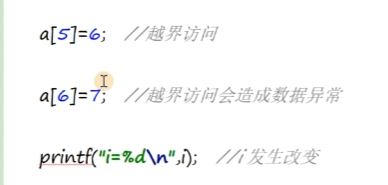
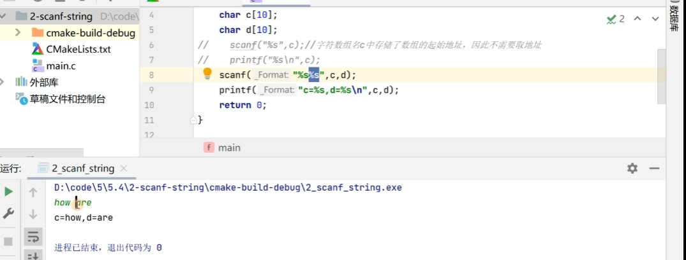
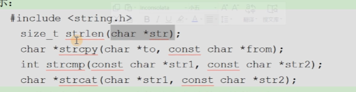

# 一维数组和字符数组

这一章的内容主要是听课就可以了

## 一维数组

```C++

```

访问越界



## 字符数组

**主要问题是输入输出的形式，这里进行一个重点的复习**

### printf

```cpp
char c[5]={'h','e','l','l','o'};
printf("%s\n",c);

如果我们使用上面的形式，因为printf输出字符串会读到'\0'才会结束，如果我们用上面的方式赋值就不会读入到'\0'，此时就会出现错误，但是如果我们用下面的方式来定义，则可以正确输出
char c[5]="hello"; // 此时我们就可以正确输出

```

### scanf读取字符串

```cpp
char c[10];
scanf("%s",c); // 字符数组名当中存储了数组的起始地址
```

需要注意的是，scanf会清除掉空白字符



### gets和puts

一次性读入和输出字符串，这样我们就可以开始了

```cpp
char c[20];
gets(c); // gets 中放入我们字符数组的数组名即可
puts(c); // puts相当于printf("%s\n");
```

### str系列字符串操作函数



```cpp
这里讲述str库当中一些函数接口的具体应用
strlen(char *str); // 求字符串的长度
strcpy(char *to, const char *from); // 拷贝，从from拷贝到to
int strcmp(const char *str1,const char *str2); // 比较，按照字典序进行比较 str1和str2进行比较
char *strcat(chat *str1,const char *str2); // 进行拼接 将str2接到str1的后面
```
