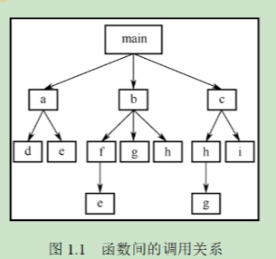
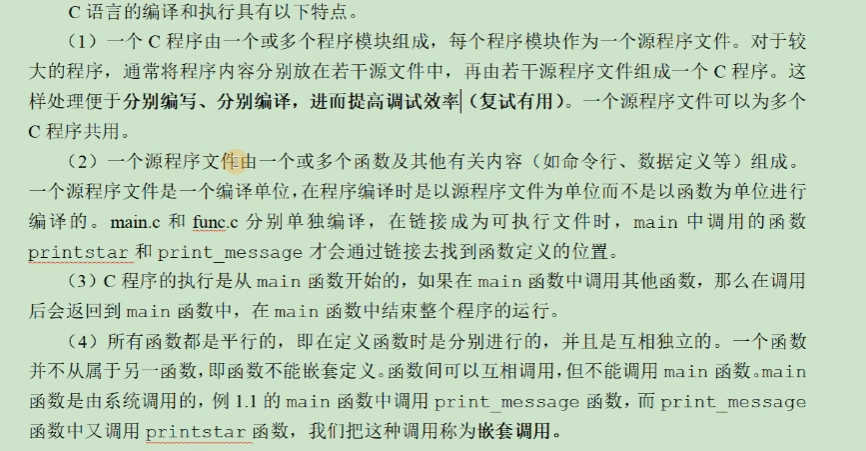
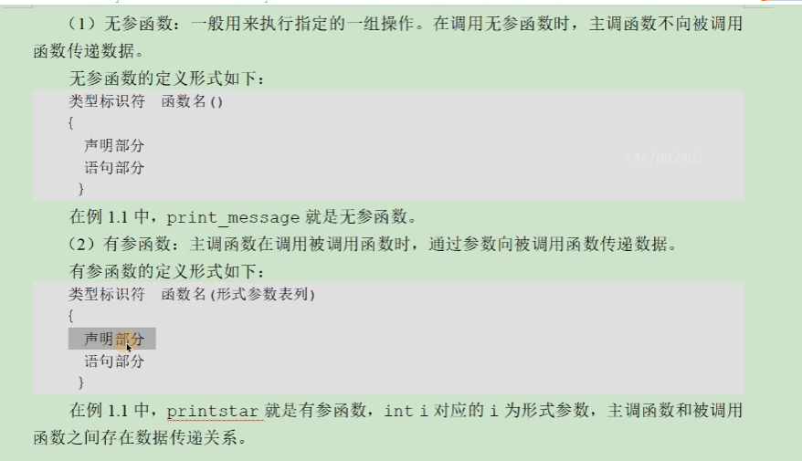
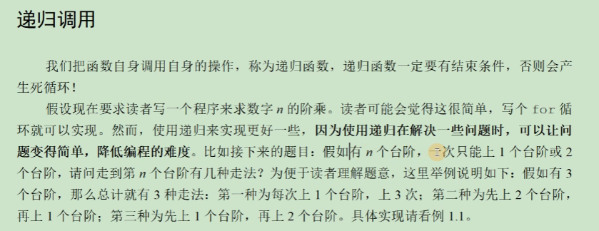
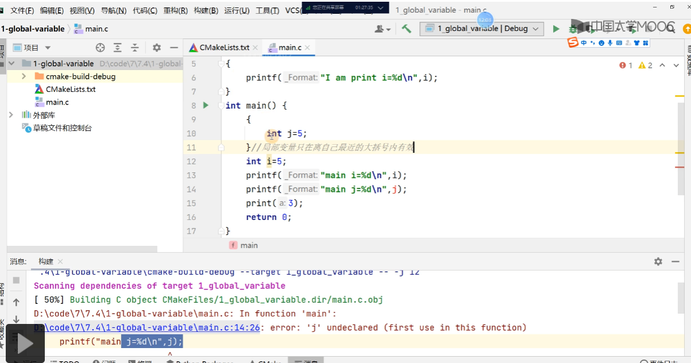
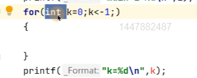

# 函数

## 函数的声明与定义

### 函数间的调用关系

由主函数调用其他函数，其他函数也可以互相调用。一个完整的程序的调用结构基本如下：



就算是多线程的程序也是用main函数作为入口的，但是注意main也不过是一个函数罢了，可以被自身调用，也就是一种递归的调用，但是当然也不是重启程序这样的操作，也是在原本的main函数上进行栈空间的开辟，最后释放。

主要还是函数的定义这个部分：

```C
#include <stdio.h>
#include <stdlib.h>

// 声明
void print_message();
int main(void){
    print_message();
    return 0;
}
// 函数的定义
void print_message(){
    printf("hello world!");
}
```

### C语言编译和执行的特点



### 函数的分类



## 函数的递归调用

函数自身调用自身的操作就是递归，当然我们如果是使用main函数调用自身也是一种递归。

递归的核心就是需要寻找递推公式，例如我们进行阶乘的函数 `f(n)=f(n-1) * n`这里就是我们的递归公式了，当然大部分时候还是抽象的，我们最常见的递归还是用于树形结构的递归，因为树形结构的定义本身就是递归的，那么我们都可以将树的运算变成计算左子树+右子树，或者左子树和右子树的顺序操作相类似的操作。

看下面的问题：



这样的题目，其实本质上就是个简单的动态规划的问题，但是其实就是斐波那契数列，如果不使用动态规划的话，这样也就是递归的形式来操作的，那么我们开始分析：

```txt
首先设到达第n个台阶的时候
我们有方式为step(n) = step(n-1) + step(n-2)
其中step(n-1)+step(n-2)就是说我们只能通过距离1个台阶的位置或者2个台阶的位置到达我们当前的楼梯

其实这里对比动态规划也可以简单的发现，其实本质上递归就是一种从后向前的逆向的方式，而递归的结束条件也就是相当于动态规划里面的初始化的过程
而动态规划是一种从前向后的顺序的方式，我们初始化之后利用循环向后推导。
```

## 局部变量和全局变量

全局变量：生命周期是从程序运行开始到结束。

局部变量：生命周期是伴随函数存在的，当函数的栈区释放之后，就会被释放掉（ 注意局部变量的应用范围，看下面的实例）





对于上面两种情况，可以发现这些变量都在外部无法使用，其实for循环就是while循环的双层打包，相当于k是在最外层的大括号定义的，然后for循环体的内容就是while循环的内容。


## 补充

**关于局部变量和全局变量的部分，可以进阶学习编译原理这一门课程，里面对变量定义底层原理也有明确的解释。**

然后就是C语言的数据段，代码段，BSS段的相关联想。
