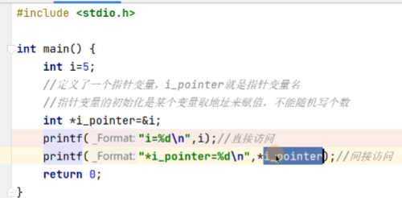
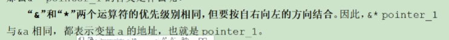
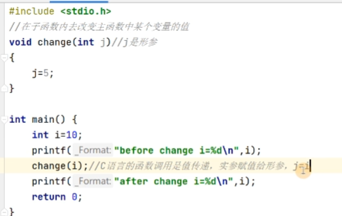
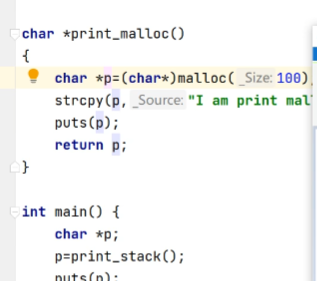

# 指针

## 指针的定义

内存区域当中每个字节都有对应的一个编号，这个编号就是”地址“

```cpp
指针的定义
基类型 *指针变量名;
举例:
	int *ptr;
```

**直接访问和间接访问：**

我们一般通过变量直接访问变量一般就是直接访问，如果我们利用指针存储然后解引用，然后通过指针变量来指向变量实际存储的空间就可以是间接访问。

指针本身占据的空间和我们选择的程序的位数是一致的，如果我们编写的是32位的应用程序那么指针就是4个字节，64位的应用程序那么指针就是8个字节。

## 取地址操作符和取值操作符

&	取地址操作符	可以做到取变量的地址 ，* 取值操作符，可以做到解引用的方式

下面一个实例就可以做到直接访问和间接访问





## 指针的使用场景

指针的使用场景一般只有两个，一个是传递，一个是偏移

### 传递



**C语言的函数调用是值传递，也就是认为我们在进入函数的时候会进行一次拷贝，而不是直接将引用传递进去。**

### 偏移

指针的偏移的使用场景就是对指针的加加减减的使用。

数组名内存储了数组的起始地址。可以用以下的方式来进行。

#### 基本应用

```cpp
#include<stdio.h>
#define N 5
int main(void){
    int a[N]={1,2,3,4,5};
    int *p = a;
    for(int i=0;i<N;i++){
        printf("%3d\n",a[i]);
    }
    for(int j=0;j<N;j++){
        printf("%3d\n",*(p+j));
    }
}
```

首先我们要理解p+1到底指向的是什么，我们可以认为，如果我们p的基类型是一个int，那么我们就向后移动了4个字节，同理，如果我们p的基类型是一个double，那么我们就向后移动了8个字节，这样，如果我们是一个结构体，那么我们p向后就会移动一个结构体类型，这样我们可以使用一些比较奇怪的操作，例如指向一个整数的中间，就利用强制转换，将一个以int为基类型的指针转换成以short为基类型，然后利用偏移，就可以指向中间。

#### 指针与一维数组

```c
#include<stdio.h>

void change(char *d){
    *d='H';
    d[1]='E';
    *(d+2) = 'E';
}

int main(void){
    char c[10] = "hello";
    change(c);
    puts(c);
    return 0;
}
```

## 指针的动态内存申请

### 指针与动态内存申请

size代表我们要申请多大字节的空间

**这里也复习了一个知识点，关于我们为什么不使用void*，因为void*类型的指针是不能使用指针偏移来进行运算的，所以我们一般不使用无类型指针。**

```c
#include <stdio.h>
#include <stdlib.h>

int main(void){
    int size;
    char *p;
    scanf("%d",&size);
    // malloc返回的起始地址是void * 类型的，所以我们需要进行强制转换
    // void * 类型的指针是不能进行偏移的，因此不会定义无类型指针
    p = (char *)malloc(sizeof(char) * size);
    gets(p);
    puts(p);
    free(p); // 通过malloc申请的元素需要利用free释放
    return 0;
}
```

### 栈空间和堆空间的区别

* 堆的效率比栈的效率要低。
* 栈空间不能够动态分配，而堆空间可以利用malloc来动态分配，也就是在程序运行的时候再进行分配。

**所以我们其实遇到了一个问题，如果在函数当中返回一个局部指针，那么我们就会发现在外部就算接收到了，但是访问到的也是一片所谓的”不存在“的空间，所以返回局部变量的指针是很大的问题。**

那么这样我们就可以在函数当中动态申请堆空间，然后返回，此时我们就可以完成了，就类似于下面的情况。




## 补充

看下面的代码

```cpp
#include <stdio.h>

int main(void){
    const int a=3;
    const int *b;
    b = &a;
//    *b=10; 如果我们利用的是const *b 那么我们指向的
    printf("%d",*b);
    return 0;
}
```

上面的代码，我们无法使用`*b = 10 `这是因为`const int *b`是一个常量指针，意味着，我们指向的变量不能被修改，同理int const *b，此时也可以实现我们的操作，那么接下来再看下面的代码：

```cpp
#include <stdio.h>

int main(void){
    const int a=3;
    int * const b;
//    b = &a;
    printf("%d",*b);
    return 0;
}
```

此时我们发现不能实现 `b=&a`这样的操作，因为我们使用的是 `int * const b`，此时意味着指针是一个常量，意味着，我们不能改变b指向的地址，那么我们其实可以在定义b的时候写成 `int *const b = &a;`此时我们就完成了我们的操作，但是此时我们也可以发现一个漏洞，我们看下面一段代码：

```c
#include <stdio.h>

int main(void){
    const int a=3;
    int * const b = &a;
    *b=2;
    printf("%d",*b);
    return 0;
}
```

此时虽然编译会有warning，但是仍然可以编译成功，同时也可以修改a的值，此时就发现，局部的const变量也并不是无法修改，但是我们仍然存在了编译报错，那么接下来我们尝试让这个编译警告消失，但是我们需要知道为什么会报警告，报错是因为，我们利用了一个可以修改地址存储的值的指针去指向了一个const变量，也就是说，我们写成下面的方式，还是会出错，注意这里的报错是指的是warning：

```c
#include <stdio.h>

int main(void){
    const int a=3;
    int * b = &a;
    *b=10;
    printf("%d",a);
    return 0;
}
```

那么我们这样写，就可以避免报错

```c
#include <stdio.h>

int main(void){
    const int a=3;
    const int *b = &a;
    int *c = (int *)b;
    *c = 10;
    printf("%d",a);
    return 0;
}
```

利用强制类型转换就可以解决这个问题了。
