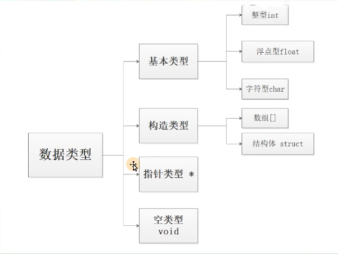

# 数据类型 数据的输入输出

## 数据类型的分类



## C语言的关键字


这里并不需要特别的记忆，只有32个关键字

## 常量

常量是指在运行过程当中，其值不发生变化的值，常量又可以分为整型、实型、字符型、字符串型

### ※整型常量的不同进制转换

1个字节 byte对应8位，bit

1KB = 1024 字节

1MB = 1024KB

1GB = 1024MB

123十进制，利用除k取余的方式不断短除，最后反向将元素写出来，就得到了结果。

**二进制转化为十六进制，二进制数四位为一组，转化为一个十六十六进制数位**

### 利用C语言输出不同进制的数

```cpp
#include<stdio.h>
int main(int argc, char const *argv[])
{
    int i=123;
    printf("%d\n",i);
    printf("%o\n",i);//输出八进制
    printf("%x\n",i);//输出十六进制
    return 0;
}

```

同时我们可以在内存视图当中看到，对于整型变量，我们是反着存储的，这个是因为在Intel CPU当中是小端存储的，低字节在前。（OS：之前在CSAPP的课程当中肯定是学习过了，汇编语言都会读一部分了）

### 字符串常量

末尾一定是一个'\\0'，这样的话例如我们一个字符串是"hello"，则其占的空间为6个字节

## 变量

变量代表内存中具有特定属性的一个存储单元，它用来存放数据、即变量的值。**这些值在程序的执行过程当中是可以改变的。**

这里有一个很重要的问题就是标识符的问题，C语言规定，标识符只能由字母、数字和下划线三种字符组成。

### 整型

**补充：符号常量，利用define进行定义的一些变量，当然也不是真正的变量，编译器在编译的过程中会将所有使用到这个define的位置进行替换，本质上是一个常量，并且不能给其进行赋值。**

主要分为三种：

* int	4个字节
* long	8个字节
* long long	8个字节

### 浮点


注意这里的指数形式，经常可以使用

### 字符型

大小写字母转换，大写字母转换成小写字母要+32这样就可以完成了

## printf函数介绍


这里是printf的原理。


这里是函数的声明格式，我们使用了format类型的来操作

### ※格式控制


这里是使用格式控制，利用%3d，将两次输出的整数都3位向右对齐输出出来，这里如果是%-3d，则是左对齐


这里仍然是格式控制，利用了%5.2f，保证整数部分是5位对齐，小数部分保留两位小数


## scanf标准输入

C语言通过函数库读取标准输入，然后通过对应函数处理将结果打印到屏幕上。

C语言本身是没有提供输入/输出关键字的，其输入和输出是通过标准函数库来是实现的。C语言通过scanf函数读取键盘输入，键盘输入又被称为标准输入，如果没有输入的话就会被阻塞。

**scanf当中读入的其实都是字符串，不过是根据我们给出的格式进行了转化，最后才实现了数据的读入。**


这里出现的问题如下，我们可以看到没有停止到我们的位置，同时调试的过程我们也可以发现一些端倪，如果我们不给变量进行初始化，进行调试的时候语句是不需要执行的，调试会直接跳入到正式执行的语句。

如图


然后我们来理解上面出现的问题


这里我们发现了一个问题，发现这里的c被赋值成为了\n，


开始的第一个scanf读入走了10，此时标准输入缓冲区当中还剩\n，这样我们第二次scanf读入的时候就会读入到\n，有一个比较好的方式，我们可以通过fflush(stdin);来清空标准输入缓冲区，此时再接着输入。

scanf再读写整型，浮点型，字符串的时候会自动忽略\n、空格符等字符

### scanf的返回值

ret=scanf("%d %c %f",&a,&b,&c);

这里的返回值是在标准输入缓冲区当中读入的个数。


## 补充知识

sizeof可以计算变量的大小
