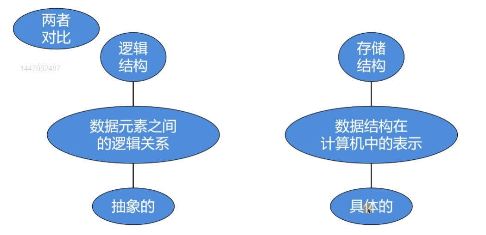
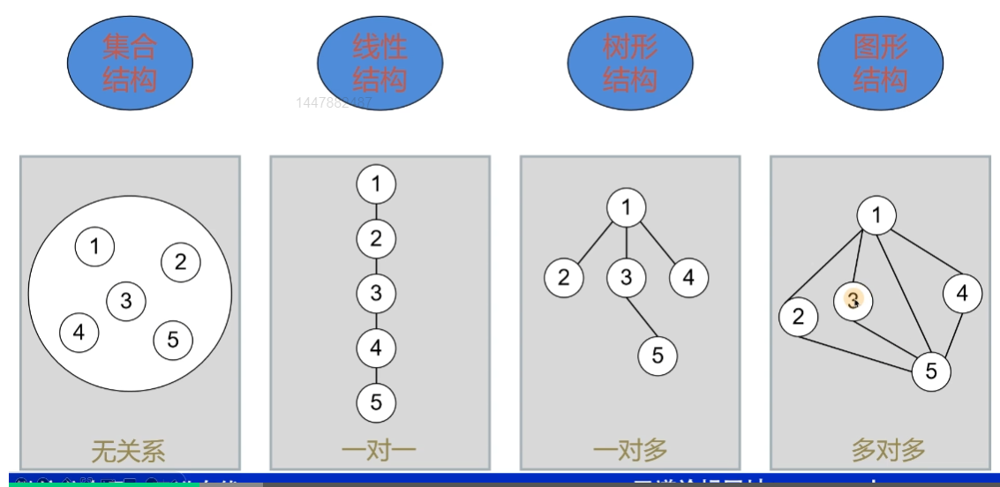
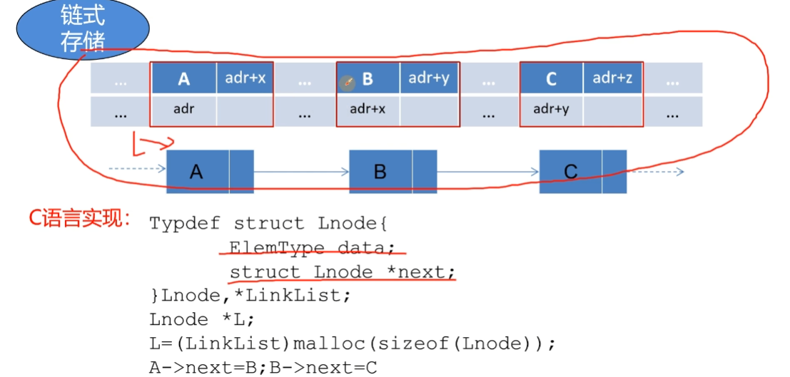
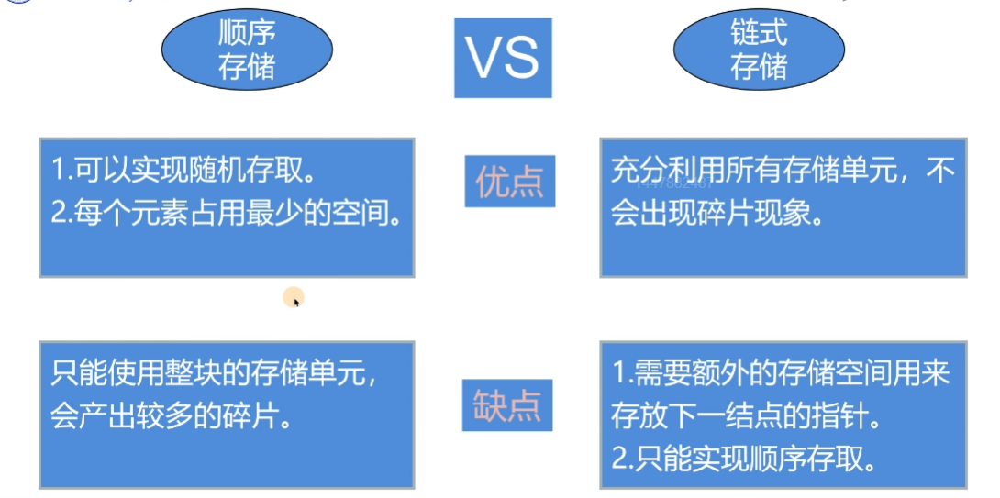
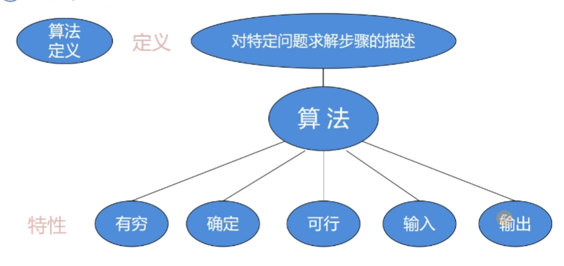
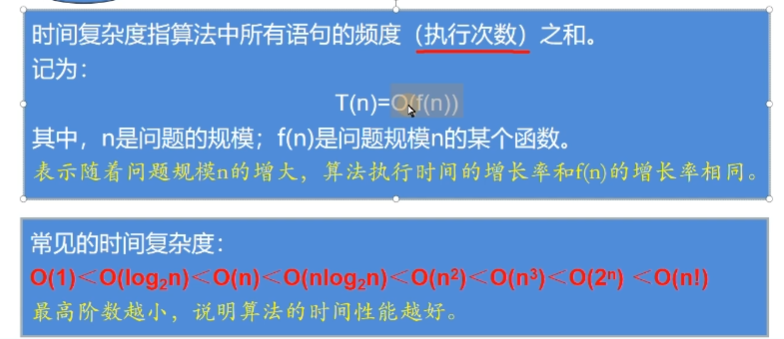
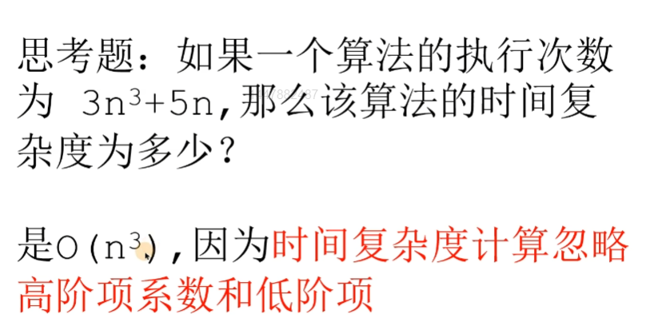

# 数据结构

## 与408的关联

* **时间复杂度**和空间复杂度
* 算法的关键思想，并且利用C和C++语言描述算法

## 逻辑结构与存储结构

### 逻辑结构

### 存储结构

* 顺序存储：在物理的内存空间当中是连续安排的，一般可以实现随机访问
* 链式存储：在物理的内存空间当中是跳跃安排的，并且通过“链节”来连接。

  

  链式存储利用一个next指向下一个节点，或者说树的下一层。

### 顺序存储和链式存储分析

* 顺序存储：方便进行查询，但是如果进行删除，或者从中间插入，则需要移动其余元素（插入或者删除位置之后的元素），此时的时间复杂度接近于O(n)，这样明显是不合适的。
* 链式存储：充分利用所有存储单元，不会出现碎片现象，此时增删的过程接近于O(1)，极大的减少了额外的开销。

  

  这里解释顺序存取，就是不能通过下标来获取，而是需要通过循环来进行查找。

## 时间复杂度和空间复杂度

### 对特定问题求解步骤的描述

### 时间复杂度

时间复杂度指算法当中所有语句的频度（执行次数）之和：

### 空间复杂度

空间复杂度S(n)指算法运行过程中所使用的**辅助空间**。

空间复杂度O(1)，例如：n个元素数组排序，不使用额外的空间（随着n的增长而增长的空间叫做额外空间），那么就是O(1)
