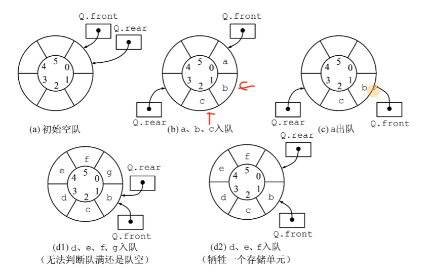
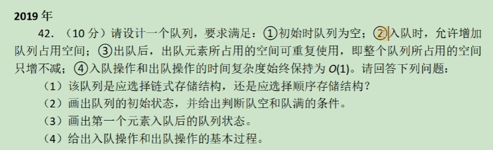

# 栈和队列

## 与408的关系解析

栈一般是选择题，大题较少，队列选择题大题都可能出现

## 栈的相关操作

下面是王道给出的定义，我进行了自主的编写和一部分的优化。

同时这个是在课前写的内容，可能和课程会有一点出入

```C++
#include <iostream>
using namespace std;

#define MaxSize 5
#define ElemType int

// 这里使用王道C语言督学营当中给出的定义
// 对于操作系统内部的栈，一般top是指向第一个空单元的
// 而王道书当中的栈，是指向最高的满单元的
typedef struct {
    ElemType data[MaxSize]; //数组
    int top;
}SqStack;

// 初始化栈
void InitStack(SqStack &S){
    S.top = -1; // 当前栈为空
}

// 判断是否为空
bool StackEmpty(SqStack &S){
    if(-1 == S.top){
        return true;
    }else{
        return false;
    }
}

// 入栈
bool Push(SqStack &S, ElemType x){
    if(MaxSize - 1 == S.top){
        return false;
    }
    S.data[++S.top] = x;
    return true;
}

// 出栈
bool Pop(SqStack &S, ElemType &x){
    if(StackEmpty(S)){
        return false;
    }

    x = S.data[S.top--];
    return true;
}

// 读取栈顶元素
bool GetTop(SqStack &S, ElemType &x){
    if(-1 == S.top){
        return false;
    }
    x = S.data[S.top];
    return true;
}
int main(void){
    SqStack  S;
    InitStack(S);
    int x;
    for(int i = 0; i < 3; i++){
        cin >> x;
        Push(S, x);
    }
    for (int i = 0; i < 3; ++i) {
        Pop(S, x);
        printf("%2d",x);
    }
    return 0;
}
```


## 队列的相关操作

这个也是在上课之前进行编写的，可能与视频课程有一些出入。

后面会有一份更加深刻的解释

```C++
#include <iostream>
using namespace std;
#define MaxSize 5
#define ElemType int

// 这里也是C语言督学营当中的代码实现
// 这里的实现是利用了一个附加空间来实现的，队尾永远指向空单元
typedef struct {
    ElemType data[MaxSize]; // 数组，存储MaxSize个元素
    int front,rear; // 队列头 队列尾
}SqQueue;

// 初始化
void InitQueue(SqQueue &Q){
    Q.rear = Q.front = 0;
}

// 判空
// 队尾永远指向空单元
bool isEmpty(SqQueue &Q){
    if(Q.rear == Q.front){ // 此时头和尾指针指向同一个位置，代表当前是空的
        return true;
    }
    return false;
}

// 判满
bool isFull(SqQueue &Q){
    if((Q.rear+1) % MaxSize == Q.front){ // 判断是否队伍是满的
        return true;
    }
    return false;
}

// 入队
bool EnQueue(SqQueue &Q, ElemType x){
    if(isFull(Q)){ // 如果此时是满的
        return false;
    }
    Q.data[Q.rear] = x;
    Q.rear = (Q.rear+1) % MaxSize;
    return true;
}

// 出队
bool DeQueue(SqQueue &Q, ElemType &x){
    // 如果是空的话
    if(isFull(Q)){
        return false;
    }
    x = Q.data[Q.front];
    Q.front = (Q.front+1) % MaxSize;

    return true;
}

int main() {
    SqQueue queue;
    InitQueue(queue);
  
    return 0;
}

```


## 栈 - 重写

- 先进后出 (FILO)
- C语言督学营当中给出的top指向的是最大的有数字的位置，而不是空单元，则S.top为-1的时候，此时栈为空
- 其实入栈之后并不需要真正的“出栈”，只需要调成栈顶指针就可以了


### 栈的实现代码

这个部分十分的简单，直接在下面放整体的代码


```cpp
#include<stdio.h>
#include<stdlib.h>

#define MaxSize 50
typedef int ElemType;

typedef struct {
    ElemType data[MaxSize];
    int top;
}SqStack;


// 初始化栈
void InitStack(SqStack &S){
    S.top = -1;
}

// 判断栈是否为空
bool StackEmpty(const SqStack S){
    if(S.top == -1){
        return true;
    }
    return false;
}

// 入栈
bool Push(SqStack &S, ElemType x){
    // 判断是否满
    if(S.top == MaxSize-1){
        return false;
    }
    S.data[++S.top] = x;
    return true;
}

// 获取栈顶元素 （但是不是出栈）
bool GetTop(const SqStack S,ElemType &x){
    if(StackEmpty(S)){
        return false;
    }
    x = S.data[S.top];
    return true;
}

// 出栈
bool Pop(SqStack &S,ElemType &x){
    if(StackEmpty(S)){
        return false;
    }
    x = S.data[S.top--]; // 出栈
    return true;
}

int main(void){
    SqStack S;
    InitStack(S);

    bool flag;
    flag = StackEmpty(S);

    if(flag){
        printf("stack is empty \n");
    }


    Push(S,3);
    Push(S,4);

    int x;
    flag = GetTop(S, x);
    if(flag){
        printf("The top is %d\n",x);
    }

    Pop(S, x);

    if(flag){
        printf("The pop element is %d\n",x);
    }

}
```


## 队列 - 重写

- 我们这里主要实现的是循环队列
- 只允许一端进行插入，一端进行删除
- 先进先出 FIFO
- 可以存储 `MaxSize-1`个元素
- 开始的时候是front和rear是相等的，此时是判断循环队列为空
- 当开始装入元素，rear向后一个位置，可以认为rear永远指向了空单元的位置
- 当 `(rear+1)%MaxSize = front`，此时代表循环队列满了，可以看到这个过程中，循环队列装入最多元素个数为 `MaxSize-1`个




### 队列的实现代码


这里提供两种方式来实现循环队列或者队列


#### 顺序表来实现循环队列

```cpp
#include<stdio.h>
#include<stdlib.h>

#define MaxSize 5
typedef int ElemType;

typedef struct {
    ElemType data[MaxSize];
    int front,rear;
}SqQueue;

// 初始化循环队列
void InitQueue(SqQueue &Q){
    Q.front = Q.rear = 0; // 初始化循环队列，就是让头和尾都指向零
}

// 判断循环队列是否为空
bool isEmpty(const SqQueue Q){
    return Q.rear == Q.front;
}

// 判断循环队列是否为满
bool isFull(const SqQueue Q){
    return (Q.rear+1)%MaxSize == Q.front;
}

// 实现入队操作
bool EnQueue(SqQueue &Q, ElemType x){
    // 判断循环队列是否满
    if(isFull(Q)){
        return false;
    }

    Q.data[Q.rear] = x; // 入队
    Q.rear = (Q.rear+1) % MaxSize; // 回到开头

    return true;
}

// 实现出队操作
bool DeQueue(SqQueue &Q, ElemType &x){
    // 判断循环队列是否为空
    if(isEmpty(Q)){
        return false;
    }

    x = Q.data[Q.front];

    Q.front = (Q.front+1) % MaxSize;
    return true;
}


int main(void){

    SqQueue Q;
    InitQueue(Q);

    bool ret;
    ret = isEmpty(Q);

    if(ret){
        printf("The queue is empty!\n");
    }else{
        printf("The queue is not empty!\n");
    }

    ret = EnQueue(Q,3);

    if(ret){
        printf("EnQueue success!\n");
    }else{
        printf("EnQueue failed!\n");
    }
    int x;
    ret = DeQueue(Q,x);

    if(ret){
        printf("DeQueue success!\n");
    }else{
        printf("DeQueue failed!\n");
    }
    return 0;
}
```


#### 链表来实现队列

- 有一定的好处，这样我们可以不需要使用所谓的MaxSize这样的参数，而是在堆区申请空间来进行
- 本质上就是有尾指针的链表罢了，并没有什么奇妙的事情
- 这里实现采用带头结点的链表来实现的
- 不需要实现判断队列空的情况，因为front和rear指向相同的时候，就是同时指向空的头节点的时候，就是空的情况
- **主要需要注意的位置是出队的情况，出队需要判断是不是最后一个结点了，否则释放的时候会出现尾指针无法调整的情况**


```cpp
#include<stdio.h>
#include<stdlib.h>

typedef int ElemType;

// 利用链表实现队列
typedef struct LinkNode{
    ElemType data;
    struct LinkNode *next;
}LinkNode;


typedef struct {
    LinkNode *front, *rear; // 队列头部和尾部
}LinkQueue;

// 初始化队列 使用的是带头结点的链表来实现
void InitQueue(LinkQueue &Q){
    Q.front = Q.rear = (LinkNode *)malloc(sizeof(LinkNode));
    Q.front->next = nullptr;
}

// 入队
void EnQueue(LinkQueue &Q, int x){
    LinkNode* pNew = (LinkNode *) malloc(sizeof(LinkNode));
    pNew->data = x;
    pNew->next = nullptr; // 让next为 nullptr 防止内存泄露，访问越界
    Q.rear->next = pNew;
    Q.rear = pNew;
}

// 出队 其实本质上就是删除第一个结点
bool DeQueue(LinkQueue &Q, int &x){
    // 此时为空
    if(Q.rear == Q.front){
        return false;
    }

    LinkNode *q = Q.front->next;
    Q.rear->next = q->next;
    // 链表尾部等于第一个结点
    if(Q.rear == q){
        Q.rear = Q.front;
    }
    free(q); // 直接释放
    q = nullptr ; // 防止内存泄露
    return true;
}

int main(void){
    LinkQueue Q;
    InitQueue(Q);
    EnQueue(Q,3);
    EnQueue(Q,4);

    ElemType element;
    bool ret;
    ret = DeQueue(Q,element);
    if(ret){
        printf("DeQueue success element = %d\n",element);
    }else{
        printf("DeQueue failed\n");
    }
    return 0;
}
```


#### 真题解析-链表实现循环队列



- 分析：
  - 其实本质上就是利用链表实现循环队列
  - 占用的空间可以重复使用代表我们出队的时候不需要释放空间
  - 允许增加队列占用空间代表，队列满的时候，我们可以插入元素

这个题目之后再刷题的过程中遇到后自己重新写一下，还是需要注意的
