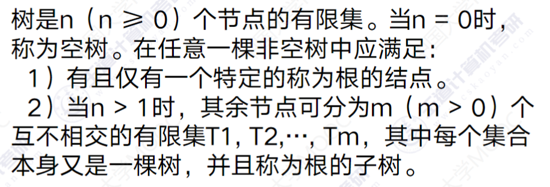
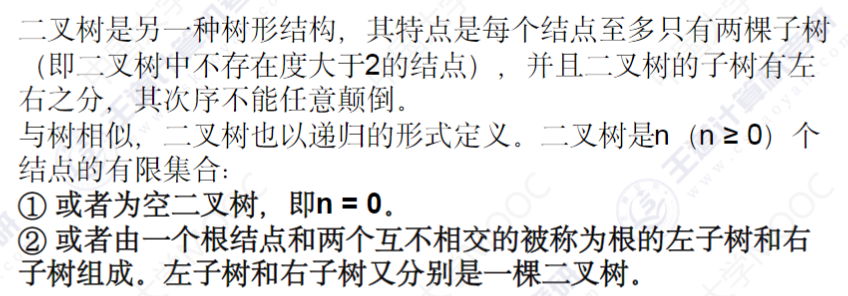
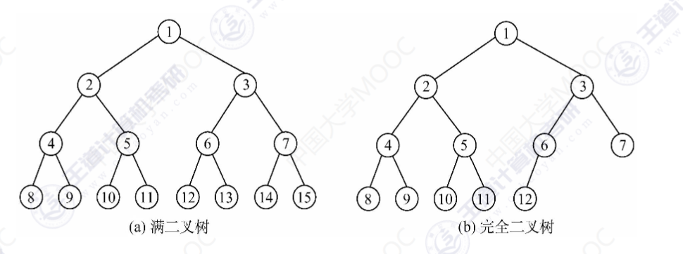
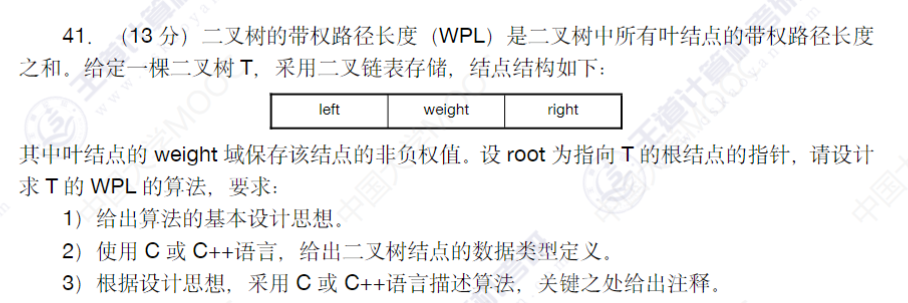

# 树与二叉树

## 与408的关联解析

- 树的遍历：前序中序后序遍历
- 二叉树的层序遍历创建树
- 大题和小题的形式，以小题为主，因为相对来讲比较困难

## 树的定义




## 二叉树

### 定义



### 满二叉树和完全二叉树



### 二叉树的顺序存取

根据层序，从上到下，从左到右进行遍历标号（层序遍历），然后将二叉树顺序放入顺序表当中，可以实现二叉树的顺序存取。

### 二叉树的层次建树

- 主要是通过辅助队列来进行

`function.h`

```cpp
//
// Created by wengy on 2023-01-31.
//

#ifndef TESTNEW_FUNCTION_H
#define TESTNEW_FUNCTION_H

#include<stdio.h>
#include<stdlib.h>

typedef char BitElemType;

typedef struct BiTNode{
    BitElemType c;
    struct BiTNode *lchild;
    struct BiTNode *rchild;
}BiTNode, *BiTree;

// 辅助队列
typedef struct tag{
    BiTree p;
    struct tag *pnext;
}tag_t, *ptag_t;

#endif //TESTNEW_FUNCTION_H

```

`main.cpp`

```cpp
// 层次建树实战，需要利用一个辅助队列来进行二叉树层次建树

#include "function.h"

int main(void){
    BiTree pnew;
    BiTree tree = nullptr ; // tree是指向树根的，代表树
    char c;
    ptag_t phead = nullptr, ptail = nullptr, listpnew = nullptr, pcur;

    // abcdefghij
    while(scanf("%c",&c)){
        if(c == '\n'){
            break; // 读取到换行就结束，因为我们是按照字符格式进行读取的，所以这里会识别到\n，而不会识别到空格
        }
        pnew = (BiTree) calloc(1,sizeof(BiTNode)); // calloc申请的空间大小是两个直接相乘，并且赋值为0,也就是这里不需要进行指针空置

        pnew->c = c;
        listpnew = (ptag_t) calloc(1,sizeof(tag_t)); // 给队列节点申请空间
        listpnew->p = pnew;
        listpnew->pnext = nullptr;

        // 如果此时第一个节点是空的那么就开始指向
        if(nullptr == tree){
            tree = pnew;
            // 同时让队头和队尾指向同一个节点
            ptail = listpnew;
            phead = listpnew;
            pcur = listpnew;
        }else{
            ptail->pnext = listpnew;
            ptail = listpnew;
            // 接下来把b节点放入树当中
            if(nullptr == pcur->p->lchild){
                // 如果左孩子是空的
                pcur->p->lchild = pnew;
            }else if(nullptr == pcur->p->rchild){
                pcur->p->rchild = pnew;
                pcur = pcur->pnext; // 此时往下赋值
            }
        }
    }


    return 0;
}
```

### 二叉树的遍历

- 在之前的建树基础之上进行代码的编辑
- 每次只看一棵子树
- 这里解释一下为什么叫做前序遍历，前序遍历其实就是作为的前中序遍历，也就是中左右，后序遍历就是后中序遍历，也就是左右中，中序遍历其实就是中中序遍历，也就是左中右，中序遍历尤为关键，如果有中序遍历和前序遍历或者后序遍历，就可以还原树的结构
- 层次遍历的思路还是需要使用队列来实现
- 前序遍历就是**深度优先遍历**，向左侧结点一直到底部

代码如下：这里只展示遍历的主要逻辑，而且使用的是非递归的形式，之后会使用队列实现非递归形式的代码

```cpp
// 前序遍历
void PreOrder(BiTree p){
    if(nullptr == p){
        return;
    }
    printf("%c",p->c);
    PreOrder(p->lchild);// 打印左子树
    PreOrder(p->rchild);// 打印右子树
}

// 中序遍历
void InOrder(BiTree p){
    if(nullptr == p){
        return;
    }
    InOrder(p->lchild);
    printf("%c",p->c);
    PreOrder(p->rchild);
}

// 后序遍历
void PostOrder(BiTree p){
    if(nullptr == p){
        return;
    }

    PostOrder(p->lchild);
    PostOrder(p->rchild);
    printf("%c",p->c);
}
```

### 层序遍历

- 这里的实现利用的队列是之前课程当中实现的代码，这里展示主要逻辑
- 当然这个过程中我也查出了很多问题

```cpp
// 层序遍历
// 主要流程就是一个入队和出队的过程，并没有很复杂，当然我们也可以用C++当中内置的队列来实现
void LevelOrder(BiTree T){
    LinkQueue Q;
    InitQueue(Q);
    BiTree p = nullptr; // 指向打印出来的结点
    EnQueue(Q,T);
    while(!IsEmpty(Q)){ // 判断队列是否为空
        DeQueue(Q,p);
        if(p->lchild != nullptr){
            EnQueue(Q,p->lchild);
        }
        if(p->rchild != nullptr){
            EnQueue(Q,p->rchild);
        }
        cout << p->c << " ";
    }
}
```


### 真题讲解



利用深度优先搜索（先序遍历）来进行，利用一个静态变量来记录WPL，这样方便我们进行。

这个题其实就是采用一种遍历方式，然后携带自身的层次来进行就好，也没有很复杂的情况。

**需要注意的情况是，WPL计算的是路径，也就是深度为1的时候路径长度为0，深度为2的时候，路径长度为1，所以和深度并不相同。**

代码如下：

```cpp
int wpl=0;
// 前序遍历
void PreOrder(BiTree p, int deep){
    if(nullptr == p){
        return;
    }
    if(nullptr == p->lchild && nullptr == p->rchild){
        wpl += (int)p->c * deep;
    }
    PreOrder(p->lchild,deep+1);// 打印左子树
    PreOrder(p->rchild,deep+1);// 打印右子树
}
```

OS：如果真的考到这种难度的题目的话，那么一定要拿分。

### z总结

- 遍历方式
- 层序创建一棵树
- 通过各种遍历方式还原一棵树
