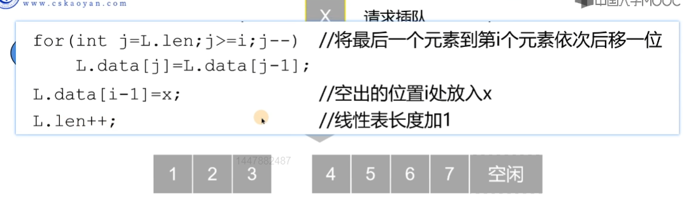

# 线性表

## 线性表的相关性质


* 表中元素的个数是有限的
* 表中元素的数据类型都相同，意味着每一个元素占用相同大小的空间
* 表中元素具有逻辑上的顺序性，在序列中各元素排序有其先后顺序

## 线性表的顺序表示

* 逻辑上相邻的两个元素在物理位置上也相邻

  
* 优点：

  * 可以实现随机存取，访问表中任意一个元素
  * 存储密度高，每个结点只存储数据元素
* 缺点：

  * 插入和删除操作需要移动大量元素
  * 线性表变化较大，难以确定存储空间的容量
  * 存储分配需要一整段连续的存储空间，不够灵活

### 插入操作




### 删除操作


这里的代码其实都有一个共同的特性，这里所谓的第几个元素，代表的是我们从1开始计算的，而数组下标是从0开始的，所以我们需要减一才能完成。

按照下面的方式进行动态分配可以。


### 代码实现

下面的代码是用C++实现的，虽然大部分使用的是C的语法

```cpp
#include<stdio.h>

#define MaxSize 50
typedef int ElemType; // 让顺序表存储其他类型元素时，可以快速完成代码修改

typedef struct {
    ElemType data[MaxSize];
    int length;
}SqList;

// 顺序表的插入，因为L会改变，因此我们这里需要使用引用，i是插入位置
bool ListInsert(SqList &L, int pos, ElemType element){
    // 判断插入位置是否合法
    if(pos < 1 || pos > L.length+1){
        return false;
    }
    // 如果存储空间满了就不能插入
    if(L.length == MaxSize){
        return false;
    }
    // 把后面的元素依次往后移，插入元素
    for(int j = L.length ; j >= pos ; j--){
        L.data[j]  = L.data[j-1];
    }
    L.data[pos] = element;
    L.length ++ ;
    return true;
}

// 打印顺序表
void PrintList(SqList L){
    int i;
    for(i  = 0; i<L.length; i++){
        printf("%3d",L.data[i]); // 为了打印到同一行
    }
    printf("\n");
}

// 删除顺序表当中的元素，pos是要删除的元素的位置，del是为了获取被删除元素的值
bool ListDelete(SqList &L, int pos, ElemType &del){
    // 判断的元素的位置是否合法
    if(pos<1 || pos>L.length){
        return false;
    }
    // 保存需要被删除的值
    del = L.data[pos];

    int j;

    for(j=pos-1; j<L.length-1;j++){
        L.data[j] = L.data[j+1];
    }
    L.length--;
    return true;
}

int LocateElem(SqList L, ElemType element){
    int i;
    for(i=0; i<L.length;i++){
        if(element == L.data[i]){
            return i+1;
        }
    }
    // 如果没有找到就是0
    return -1;
}

int main(void){
    SqList L; // 定义一个顺序表，变量L
    bool ret; // ret用来装载返回值
    L.data[0] = 1;
    L.data[1] = 2;
    L.data[2] = 3;
    L.length = 3;
    ret = ListInsert(L, 2, 60);
    if(ret){
        printf("insert sqlist success.\n");
        PrintList(L);
    }else{
        printf("insert sqlist failed. \n");
    }
    ElemType del; //删除元素保存在del当中
    ret = ListDelete(L, 1, del);
    if(ret){
        printf("delete sqlist success.\n");
        PrintList(L);
    }else{
        printf("delete sqlist failed.\n");
    }
    int pos; // 存储元素位置
    pos = LocateElem(L, 60);
    if(pos){
        printf("find this element : %d\n",pos);
    }else{
        printf("don't find this element \n");
    }
    return 0;
}
```

代码实现还是很简单的，但是主要考的还是链式存储，顺序存储主要跟排序算法挂钩。

## 线性表的链式表示

简称链表

### 特点

从顺序表的缺点来说：

* 插入和删除需要操作移动大量元素
* 数组的大小不好确定
* 占用一大段连续的存储空间，造成了很多碎片

单链表的物理存储格式：


单链表的一般形式：


头结点和第一个结点的区别，头结点时空的，而第一个结点是有数值的结点。


链表的优点：

* 插入和删除操作不需要移动元素，只需要修改指针
* 不需要大量的连续存储空间。

链表的缺点：

* 单链表附加指针域，也存在浪费存储空间的缺点。
* 查找操作时需要从表头开始遍历，依次查找，不能随机存取。

## 链表的增删查改

这里只记录查找，后面的算法直接以代码的形式来完成

### 插入

* 头插法新建链表

  ```cpp
  #include <stdio.h>
  #include <stdlib.h>
  #define ElemType int

  // 利用头插法新建一个链表

  typedef struct LNode{
      ElemType data;
      struct LNode *next;
  }LNode, *LinkList;

  // LNode* 是结构体指针，和LinkList是完全等价的
  // 输入3，4，5，6，7，9999
  void list_head_insert(LinkList &L){
      ElemType x;
      L = (LinkList) malloc(sizeof(LNode)); // 申请头结点空间，头指针指向头结点
      L->next = NULL;
      scanf("%d",&x);
      LNode *s;
      while(x != 9999){
          s = (LinkList) malloc(sizeof(LNode));
          s->data = x;
          s->next = L->next; //s的next指向的是原本链表的第一个结点
          L->next = s;
          scanf("%d",&x);
      }

  }

  // 打印链表
  void print_list(LinkList L){
      L = L->next;
      while(L != NULL){
          printf("%3d",L->data);
          L = L->next;
      }
      printf("\n");
  }

  int main(void){
      LinkList L; // L是链表头指针
      list_head_insert(L);
      print_list(L);
      return 0;
  }
  ```
* 尾插法新建链表

  ```cpp
  #include <stdio.h>
  #include <stdlib.h>
  #define ElemType int

  // 利用尾插法新建一个链表

  typedef struct LNode{
      ElemType data;
      struct LNode *next;
  }LNode, *LinkList;

  // LNode* 是结构体指针，和LinkList是完全等价的
  // 输入3，4，5，6，7，9999
  void list_tail_insert(LinkList &L){
      L = (LinkList) malloc(sizeof(LNode));
      L->next=NULL;
      ElemType x;
      scanf("%d", &x);
      LNode *s, *r = L; // s是用来指向申请的新结点，r始终指向链表的尾部
      while(x != 9999){
          s = (LinkList) malloc(sizeof(LNode));
          s->data=x;
          r->next=s;
          r=s; // r指向新的尾部
          scanf("%d",&x);
      }
      r->next = NULL ; // 让尾结点的
  }

  // 打印链表
  void print_list(LinkList L){
      L = L->next;
      while(L != NULL){
          printf("%3d",L->data);
          L = L->next;
      }
      printf("\n");
  }

  int main(void){
      LinkList L; // L是链表头指针
      list_tail_insert(L);
      print_list(L);
      return 0;
  }
  ```

### 按位置查找

```cpp
// 按照位置进行查找
LinkList GetElem(LinkList L, int SearchPos){
    if(SearchPos <= 0 ){
        return  NULL;
    }
    for(int i=0; i<SearchPos && L != nullptr; i++){
        L=L->next;
    }
    return L;
}
```

### 按值查找

```cpp
// 按值进行查找
LinkList LocateElem(LinkList L, ElemType SearchVal){
    while(L){
        if(L->data == SearchVal){
            return L;
        }
        L=L->next;
    }
    return nullptr;
}
```

## 习题

### 头插法和尾插法的习题

利用头插法和尾插法来建立链表

```cpp
#include <iostream>
using namespace std;
#define ElemType int
typedef struct LNode{
    ElemType data;
    struct LNode *next;
}LNode, *LinkList;

void PrintList(LinkList L){
    L = L->next;
    while(L!= nullptr){
        cout << L->data;
        L = L->next;
        if(L != nullptr){
            cout<<" ";
        }
    }
    cout<<endl;
}

// 利用头插法
void list_head_insert(LinkList &L){
    L = (LinkList)malloc(sizeof(LNode));
    L->next = nullptr;
    L->data = 0;// 可以尝试进行赋值
    ElemType x;
    cin >> x;
    LinkList s;
    while(x != 9999){
        s = (LinkList)malloc(sizeof(LNode));
        s->data = x;
        s->next = L->next;
        L->next = s;
        cin >> x;
    }
}

// 利用尾插法
void list_tail_insert(LinkList &L){
    L = (LinkList)malloc(sizeof(LNode));
    L->next = nullptr;
    L->data = 0;
    LinkList cur, fro; // cur是当前的指针，fro是永远指向尾结点的指针
    fro = L; // 赋值
    ElemType x;
    cin >> x;
    while(x != 9999){
        cur = (LinkList)malloc(sizeof(LNode));
        cur->data = x;
        cur->next = nullptr;
        fro->next = cur;
        fro = fro->next;
        cin >> x;
    }
    fro -> next = nullptr;
}

int main(){
    LinkList L;
    LinkList L1;
    list_head_insert(L);
    list_tail_insert(L1);
    PrintList(L);
    PrintList(L1);
    return 0;
}
```

### 插入删除元素题目

```
#include <stdio.h>
#include <stdlib.h>
#define ElemType int

// 利用尾插法新建一个链表

typedef struct LNode{
    ElemType data;
    struct LNode *next;
}LNode, *LinkList;

// LNode* 是结构体指针，和LinkList是完全等价的
// 输入3，4，5，6，7，9999
void list_tail_insert(LinkList &L){
    L = (LinkList) malloc(sizeof(LNode));
    L->next=NULL;
    ElemType x;
    scanf("%d", &x);
    LNode *s, *r = L; // s是用来指向申请的新结点，r始终指向链表的尾部
    while(x != 9999){
        s = (LinkList) malloc(sizeof(LNode));
        s->data=x;
        r->next=s;
        r=s; // r指向新的尾部
        scanf("%d",&x);
    }
    r->next = nullptr ; // 让尾结点的
}

// 打印链表
void print_list(LinkList L){
    L = L->next;
    while(L != nullptr){
        printf("%3d",L->data);
        L = L->next;
    }
    printf("\n");
}
// 按照位置进行查找
LinkList GetElem(LinkList L, int SearchPos){
    if(SearchPos <= 0 ){
        return  NULL;
    }
    for(int i=0; i<SearchPos && L != nullptr; i++){
        L=L->next;
    }
    return L;
}

// 往第i个位置插入元素
// 这里也就体现了头结点的重要性，拥有头结点，我们可以更好的进行插入操作，极大的遍历了我们的逻辑
bool ListFromInsert(LinkList L, int InsertPos, ElemType InsertVal){
    // 这里获取了前一个元素
    LinkList p = GetElem(L,InsertPos);
    // 此时查找不到
    if(nullptr == p){
        return false;
    }
    LinkList q;
    q=(LinkList) malloc(sizeof(LNode));
    q->data = InsertVal;
    q->next = p->next;
    p->next = q;
    return true;
}

int main(void){
    LinkList L, search; // L是链表头指针
    list_tail_insert(L);
//    print_list(L);
    // 按照位置进行查找
//    search = GetElem(L,2);
//    if(search != nullptr){
//        printf("Search succeeded\n");
//        printf("result : %d\n", search->data);
//    }
//    search = LocateElem(L,6);
//    if(search != nullptr){
//        printf("Search by value succeeded\n");
//        printf("result : %d\n",search->data);
//    }
    bool ret;
    ret = ListFromInsert(L, 2,3);
    if(ret){
        printf("Insert successed!\n");
    }
    print_list(L);
    return 0;
}
```

### 单链表的删除


#### 代码实现

其实上面的题目当中有相关的实现。

```cpp
#include <iostream>
using namespace std;
typedef int ElemType;
typedef struct LNode{
    ElemType data;
    struct LNode *next;
}LNode, *LinkList;

// 按照位置进行查找
LinkList GetElem(LinkList L, int SearchPos){
    if(SearchPos <= 0 ){
        return  NULL;
    }
    for(int i=0; i<SearchPos && L != nullptr; i++){
        L=L->next;
    }
    return L;
}

// 删除第i个位置的元素
// 删除时L时不会发生改变的，所以不需要加引用
bool ListDelete(LinkList L, int i){
    LinkList p = GetElem(L, i-1);
    if(!p){
        return false;
    }
    LinkList q = p->next;
    p->next = q->next;
    free(q);
    q = nullptr; // 防止内存泄露
    return true;
}

// 尾插法构建一个链表
void list_tail_insert(LinkList &L){
    L = (LinkList)malloc(sizeof(LNode));
    L->next = nullptr;
    L->data = 0;
    LinkList cur, fro; // cur是当前的指针，fro是永远指向尾结点的指针
    fro = L; // 赋值
    ElemType x;
    cin >> x;
    while(x != 9999){
        cur = (LinkList)malloc(sizeof(LNode));
        cur->data = x;
        cur->next = nullptr;
        fro->next = cur;
        fro = fro->next;
        cin >> x;
    }
    fro -> next = nullptr;
}
// 打印链表
void print_list(LinkList L){
    L = L->next;
    while(L != NULL){
        printf("%3d",L->data);
        L = L->next;
    }
    printf("\n");
}

int main(void){
    LinkList L;
    list_tail_insert(L);
    ListDelete(L, 2);
    print_list(L);
    return 0;
}
```


## 补充


