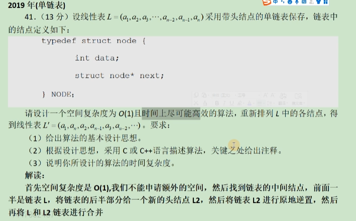

# 线性表题目解读



* 找到链表的中间节点
* 将后半链表原地逆置
* 将两个链表进行拼接形成结果

**代码实现**

```cpp
// 2019年数据结构链表大题解答
#include <iostream>
using namespace std;
typedef int ElemType;
typedef struct LNode{
    ElemType data;
    struct LNode *next;
}LNode, *LinkList;


// 尾插法构建一个链表
void list_tail_insert(LinkList &L){
    L = (LinkList)malloc(sizeof(LNode));
    L->next = nullptr;
    L->data = 0;
    LinkList cur, fro; // cur是当前的指针，fro是永远指向尾结点的指针
    fro = L; // 赋值
    ElemType x;
    cin >> x;
    while(x != 9999){
        cur = (LinkList)malloc(sizeof(LNode));
        cur->data = x;
        cur->next = nullptr;
        fro->next = cur;
        fro = fro->next;
        cin >> x;
    }
    fro -> next = nullptr;
}

// 将L2设置到中间
// 只有一个结点的时候，L2当中是没有结点的
void find_middle(LinkList L, LinkList &L2){
    // 第二条链表的头结点
    L2 = (LinkList)malloc(sizeof(LNode));

    LinkList pcur, ppre; // ※ 双指针法
    ppre = L->next;
    pcur = L->next;

    while (pcur){
        pcur = pcur->next;
        // 防止 pcur 为空
        if(nullptr == pcur){
            break;
        }
        pcur = pcur->next;
        // 遇到问题就结束当前的操作
        if(nullptr == pcur){
            break;
        }
        ppre = ppre->next;
    }
    // 由L2头结点指向后面一半链表
    L2->next = ppre->next;
    // 前一半链表的最后一个结点最后为null
    ppre->next = nullptr;
}

// 原地翻转链表
// 带头结点的逆转不需要使用引用
void reverse(LinkList L2){
    LinkList r, s, t;
    r = L2->next;
    // 链表为空
    if(nullptr == r){
        return;
    }
    s = r->next;
    if(nullptr == s){
        return;
    }
    t = s->next;
    // 原地逆置
    while(t){
        s->next = r;
        // 指针同时向后移动
        r = s;
        s = t;
        t = t->next;
    }
    s->next = r;
    // 让逆置后的链表尾部为nullptr
    L2 -> next -> next = nullptr;
    L2 -> next = s; // s 是链表的第一个结点
}

// 将链表合并
void merge(LinkList L, LinkList L2){
    LinkList pcur, p ,q;
    pcur = L->next;
    if(!pcur){
        return;
    }
    p = pcur -> next;
    q = L2 -> next;

    while(p!= nullptr && q!= nullptr){
        pcur->next = q;
        q = q->next;
        pcur = pcur->next;
        pcur->next = p;
        p = p->next;
        pcur = pcur->next;
    }
    if(p!= nullptr){
        pcur->next = p;
    }
    if(q!= nullptr){
        pcur->next=q;
    }
}

// 打印链表
void print_list(LinkList L){
    L = L->next;
    while(L != NULL){
        printf("%3d",L->data);
        L = L->next;
    }
    printf("\n");
}


int main(void){
    LinkList L  = nullptr;
    LinkList L2 = nullptr;
    list_tail_insert(L);


    find_middle(L,L2);
    reverse(L2);
    merge(L,L2);
    free(L2);
    print_list(L);
    return 0;
}
```

算法的时间复杂度分析：O(n)
