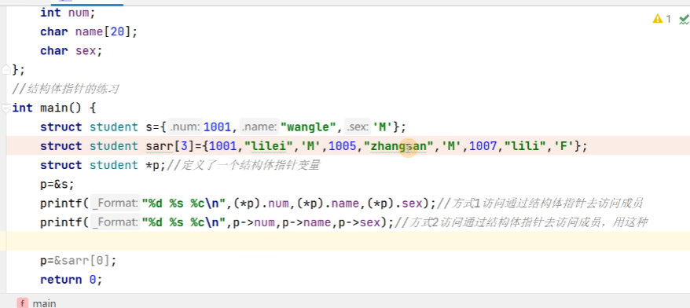

# 结构体与C++的引用

## 结构体的定义、初始化、结构体数组

有时候需要将不同类型的数据组合成一个整体，以便于引用。例如，一名学生有学号、姓名、性别、年龄、地址等属性。


上面这个实例就基本上包括结构体的全部操作了，然后循环输入和输出，这里就不进行演示了。

最后再加一个 `s.num`就可以访问num变量了。

## 结构体对齐规律

结构体的大小必须是其最大成员的整数倍。

对于上面的例子，最大成员为int，也就是4个字节，所以里面都要跟4个字节进行对齐，我们可以看到name为20个字节，是4的倍数，则不需要加起来，但是sex只有一个字节，则需要3个字节补充之后对齐，那么要用总体占用的大小63字节+3字节，之后看addr，是30个字节，并不是我们想要的4的整数倍，那么我们需要补充2个字节来对齐，那就是63+3+2=68个字节，也就完成了计算。


这样我们其实可以看到这里的char和short一共加起来占用4个字节，而不是3个字节，就是说每次以2的整数倍进行读取，所以也就不存在奇数存储这样的格式

```C
#include <stdio.h>
struct student{
    double a;
    short age;
    char height;
};
int main(void){
    struct student s = {1,2,3};
    return 0;
}

```

看上面一段代码，我们可以看到我们使用的利用内存视图可以查看一些内容，可以看到如下的结果：


可以发现，确实一个short和一个char占用的内存空间也不过就是4个字节罢了，那么我们如果将short修改成int类型的变量，可以看到如下图：


那么如果我们将char类型改为int呢


**我们可以认为当两个小存储之和小于对齐的和，我们可以将剩下的再看成一个结构体，然后再进行对齐。**

## 结构体指针与typedef的使用

关于结构体指针的使用这部分就稍微跳过，然后主要是听typedef的地方。

### 结构体指针的使用


访问结构体数组当中的元素




### typedef的使用

```C
typedef struct student{
    int num;
    char name[20];
    char sex;
}stu, *pstu;
```

我们定义的 `*pstu`其实就是**`typedef struct *student pstu`**，也就是我们定义了一个结构体指针的名字，pstu，也如下图的解释。


## C++引用以及C++的布尔类型

可以极大的降低学习数据结构的难度。

```cpp
#include<stdio.h>
// 在子函数当中需要修改主函数当中变量的值，就需要使用引用
void modify_num(int &b){ // 那形参当中写&，就称为引用
    b = b+1;
}
int main(void){
    int a=10;
    modify_num(a);
    printf("after modify_num a = %d\n",a);
    return 0;
}
```

当然我们如果要修改指针的指向：


引用必须和变量名紧邻。
