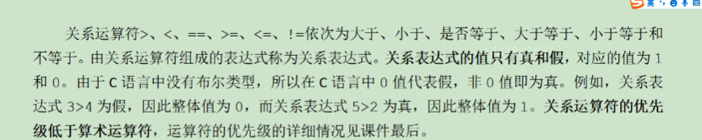
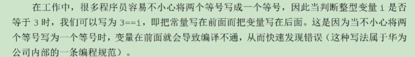
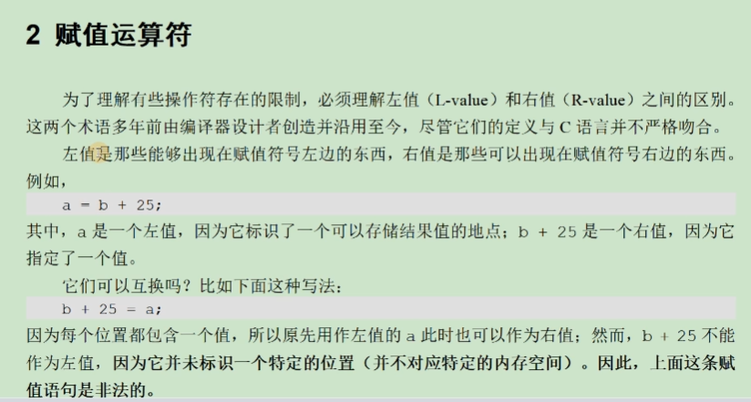

# 运算符与表达式

## 3.1 算术运算符和关系运算符

### 算术运算符

* 算术表达式：由算术运算符组成是式子
* 当操作符‘/’ 两个操作数都是整型数的时候，执行整除运算

### 关系运算符



同时为了防止==号写成=，这里我们采用将常量写在前面的形式



这样可以快速发现问题

```c
#include<stdio.h>

int main(int argc, char const *argv[])
{
    int a;
    while(scanf("%d",&a)){
        if(3<a<10){
            pritnf("a is between 3 and 10 \n");
        }else{
            // 这里其实永远也运行不到
            printf("a is not between 3 and 10.\n");
        }
    }
    return 0;
}

```

我们可以看到上面的代码，利用了一个 `3<a<10`这里是一个严重的问题，因为C语言是不支持这样的连续判断的形式的，这里假如我们输入-2，那么首先会进行运算 `3<-2`返回0，然后会判断 `0<10`此时就又得到了1，此时就会执行if下的语句，这明显是错误的，所以我们要写成 `a>3 && a<10`。

**注：算术运算符的优先级大于关系运算符的优先级**

## 3.2 逻辑运算符，求字节运算符

#### 短路运算

`i && printf("you can't see me! `

当i为0的时候后面的语句不执行，当i为1的时候后面的语句会执行，也就是对于与运算，当且仅当两个均为1的时候才能返回1。

同理可以得到

`i || printf("you can't see me!\n")`

### 赋值运算符

左值和右值：



可以放在等号左边的**变量**才可以称为左值，左值有自己确定的空间以及变量名称

复合赋值运算符：

+= -= ++ --

### 求字节运算符

sizeof 是一个运算符，并不是一个函数，和逻辑非的优先级类似

sizeof int 或者 sizeof(int) 都可以进行


## 总结

双目运算符 ：左操作数 + 又操作数 （这里的'+'可以替换成其他的运算符 ）

单目运算符：!操作数
